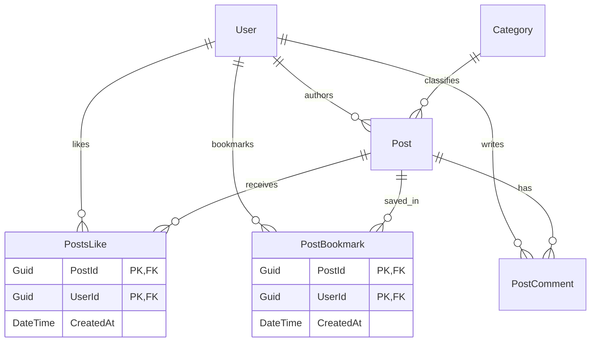

# 🌐 Modern Fullstack Blog Platform

<p align="center">
  <strong>A modern, responsive, and minimalist fullstack blogging platform built with ASP.NET Core Web API and React 19.</strong>
</p>

<p align="center">
  
  
  
  
  
  
</p>

---

## 📖 Overview

This project is an end-to-end Fullstack Web Application designed for publishing, discovering, and interacting with high-quality tech blogs and articles. Built with a focus on **clean architecture, database integrity, and a minimalist reading experience** inspired by Medium and Dev.to.

---

## ✨ Key Features

### 1. 🔐 Authentication & Authorization
* **JWT (JSON Web Token) Security:** Short-lived access token with cryptographic signature.
* **HttpOnly Cookie Refresh Tokens:** Secure sliding-session token rotation preventing XSS attacks.
* **Password Hashing:** Secure password verification via `PasswordHasher<User>`.
* **Account Recovery:** Self-service Forgot Password and Reset Token verification workflow.

### 2. 📝 Post & Content Management
* **Full CRUD Lifecycle:** Create, edit, delete, and publish articles with categories and tags.
* **Cover Photo Uploads:** Seamless cloud image integration via **Cloudinary API**.
* **Live Reading Time Calculator:** Dynamic word-count estimation computed in real-time.
* **Drafts System:** Dedicated personal draft workspace for unfinished articles.

### 3. ❤️ Social Interactions (Database Normalized)
* **Likes / Thả tim:** Many-to-Many relationship governed by composite primary keys `(PostId, UserId)` to eliminate duplicate likes at the database layer.
* **Bookmarks / Lưu bài viết:** Persistent saved posts collection with instant optimistic updates.
* **Interactive Comments:** Hierarchical comments with timestamps, author avatars, and profile navigation.
* **Native Share API:** Native mobile sharing (`navigator.share`) with automatic clipboard copy fallback.

### 4. 👤 Author Profiles & Minimalist UX
* **Interactive Author Modals:** Click any author's avatar or name on post cards or comment sections to view their profile, bio, statistics, and published stories.
* **Responsive 2-Column Minimalist Layout:** Clean layout maximizing focus on readable content without distracting sidebars.
* **Dark / Light Mode:** Persistent theme toggle with immediate CSS token switches.
* **Global Reactive State:** Centralized state management via **React Context + Reducer** for instantaneous cross-component data synchronization without page refreshes.

---

## 🛠️ Tech Stack

| Layer | Technology | Description |
| :--- | :--- | :--- |
| **Frontend** | React 19, Vite | Fast Single-Page Application (SPA) with Hooks & Context API |
| **Styling** | Tailwind CSS v4 | Modern, utility-first CSS design system |
| **Icons & UI** | FontAwesome, SweetAlert2 | Interactive iconography and polished modal alerts |
| **Backend** | ASP.NET Core Web API (.NET 10) | RESTful API with Dependency Injection and Clean Controller/Service pattern |
| **ORM / Data** | Entity Framework Core 10 | Code-First database modeling with migrations |
| **Database** | Microsoft SQL Server | Relational Database Management System (RDBMS) |
| **Media Storage**| Cloudinary | Cloud-based media storage and image transformations |
| **Auth** | JWT Bearer, Cookie Authentication | Secure token management and authorization policies |

---

## 🗄️ Database Architecture Highlights

The database is designed with strict relational constraints and normalization:



> **Engineering Note:** Both `PostsLike` and `PostBookmark` utilize **Composite Primary Keys** `(PostId, UserId)` in EF Core, guaranteeing idempotency and data consistency at the hardware/database level.

---

## 📂 Project Structure

```text
Blog-website/
├── Backend_Blog/                 # ASP.NET Core Web API Backend
│   └── Backend_Blog/
│       ├── Controllers/          # API Controllers (Auth, Post, EditProfile)
│       ├── Data/                 # DbContext and database seed configurations
│       ├── Entities/             # EF Core Entities (User, Post, Category, etc.)
│       ├── Models/               # Request/Response DTOs
│       ├── Services/             # Business Logic & Services Layer
│       ├── Migrations/           # EF Core Code-First database migrations
│       └── appsettings.json      # Connection strings and JWT credentials
│
├── blog_website/                 # React SPA Frontend
│   └── src/
│       ├── api/                  # API client fetch wrappers (Auth, Post, Client)
│       ├── components/           # Reusable components (PostCard, Header, PostComment...)
│       ├── context/              # Centralized State (Actions, Reducer, Provider, Context)
│       ├── pages/                # Views (Posts, PostDetail, Categories, Info, WritePost...)
│       ├── hooks/                # Custom React Hooks (useDirtyCheck, useInfiniteScroll)
│       └── utils/                # Utility helpers (alerts, date formatters)
│
└── README.md                     # Project documentation
```

---

## 🚀 Getting Started

### Prerequisites
* [.NET 10.0 SDK](https://dotnet.microsoft.com/)
* [Node.js](https://nodejs.org/) (v18 or newer)
* [SQL Server](https://www.microsoft.com/en-us/sql-server) (LocalDB, Express, or Developer Edition)
* [Git](https://git-scm.com/)

---

### 1. Backend Setup

1. **Navigate to the Backend project:**
   ```bash
   cd Backend_Blog/Backend_Blog
   ```

2. **Configure Database Connection:**
   Open `appsettings.json` and adjust the connection string to match your SQL Server instance:
   ```json
   "ConnectionStrings": {
     "DefaultConnection": "Data Source=localhost;Initial Catalog=DB_Blog;Integrated Security=True;Trust Server Certificate=True"
   }
   ```

3. **Apply Database Migrations:**
   ```bash
   dotnet ef database update
   ```

4. **Run the API Server:**
   ```bash
   dotnet run
   ```
   *The backend will start at `https://localhost:7198` (or `http://localhost:5264`).*

---

### 2. Frontend Setup

1. **Navigate to the Frontend directory:**
   ```bash
   cd blog_website
   ```

2. **Install dependencies:**
   ```bash
   npm install
   ```

3. **Launch the development server:**
   ```bash
   npm run dev
   ```
   *The frontend will be accessible at `http://localhost:5173`.*

---

## 📡 RESTful API Endpoints

### 🔐 Authentication (`/api/auth`)
| Method | Endpoint | Description | Auth Required |
| :--- | :--- | :--- | :---: |
| `POST` | `/api/auth/register` | Register a new user account | ❌ |
| `POST` | `/api/auth/login` | Log in and receive JWT token + Refresh Cookie | ❌ |
| `GET` | `/api/auth/me` | Fetch authenticated user profile data | ✅ |
| `POST` | `/api/auth/refresh` | Exchange Refresh Token for a new Access Token | ❌ |
| `POST` | `/api/auth/forgot-password` | Request password reset token | ❌ |
| `POST` | `/api/auth/reset-password` | Reset password using verified token | ❌ |

### 📰 Posts & Interactions (`/api/post`)
| Method | Endpoint | Description | Auth Required |
| :--- | :--- | :--- | :---: |
| `GET` | `/api/post` | Get published posts with search & year filtering | ❌ |
| `GET` | `/api/post/{id}` | Get detailed post content by ID | ❌ |
| `POST` | `/api/post` | Create a new blog post | ✅ |
| `PUT` | `/api/post/{id}` | Update an existing post | ✅ |
| `DELETE` | `/api/post/{id}` | Delete a post | ✅ |
| `POST` | `/api/post/{id}/like` | Toggle like status on a post | ✅ |
| `GET` | `/api/post/{id}/comments`| Fetch comments for a post | ❌ |
| `POST` | `/api/post/{id}/comments`| Post a new comment | ✅ |
| `POST` | `/api/post/{id}/bookmark`| Toggle bookmark status | ✅ |
| `GET` | `/api/post/my-bookmarks` | Fetch user's bookmarked posts | ✅ |
| `GET` | `/api/post/my-drafts` | Fetch user's unpublished drafts | ✅ |
| `GET` | `/api/post/popular-posts`| Get top trending posts | ❌ |

---

## 👨‍💻 Author

**Nguyễn Nhật Minh Quân**
* Role: Fullstack Developer (.NET & React)
* GitHub: [@quan02077](https://github.com/quan02077)

---

## 📄 License

This project is licensed under the [MIT License](LICENSE).
