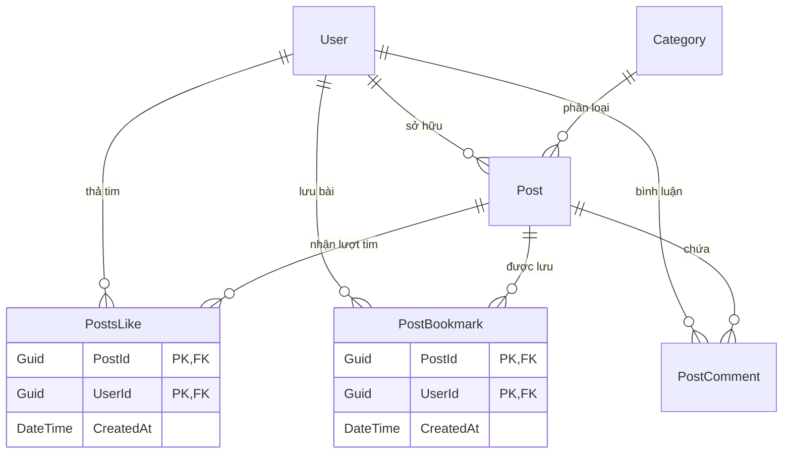

# 🌐 Nền Tảng Blog Đa Năng (Modern Fullstack Blog Platform)

<p align="center">
  <strong>Ứng dụng Blog hiện đại, tối giản và responsive được xây dựng với kiến trúc Fullstack: ASP.NET Core Web API và React 19.</strong>
</p>

<p align="center">
  
  
  
  
  
  
</p>

---

## 📖 Tổng Quan Dự Án

Dự án là một ứng dụng Web Fullstack hoàn chỉnh phục vụ nhu cầu xuất bản, khám phá và tương tác với các bài viết công nghệ chất lượng cao. Dự án chú trọng vào **Clean Architecture, tính toàn vẹn của Cơ sở dữ liệu và trải nghiệm đọc tối giản (Minimalist Reading Experience)** lấy cảm hứng từ Medium và Dev.to.

---

## ✨ Các Tính Năng Nổi Bật

### 1. 🔐 Xác Thực & Bảo Mật (Authentication & Security)
* **JWT (JSON Web Token):** Mã hóa và cấp phát Access Token an toàn cho các request yêu cầu ủy quyền.
* **Cơ chế Refresh Token qua Cookie HttpOnly:** Tự động duy trì phiên đăng nhập và cấp mới Access Token, ngăn chặn triệt để tấn công XSS.
* **Mã hóa mật khẩu:** Mật khẩu người dùng được băm an toàn thông qua `PasswordHasher<User>`.
* **Khôi phục tài khoản:** Quy trình Quên mật khẩu & Đặt lại mật khẩu dựa trên Reset Token có thời hạn xác thực.

### 2. 📝 Quản Lý Bài Viết & Nội Dung (Post Management)
* **Vòng đời CRUD hoàn chỉnh:** Tạo mới, chỉnh sửa, xóa và xuất bản bài viết theo Chuyên mục (Categories) và Thẻ (Tags).
* **Upload ảnh bìa qua Cloud:** Tích hợp tải ảnh trực tiếp lên **Cloudinary API**.
* **Tính toán thời gian đọc tự động (Read Time):** Tự động phân tích số lượng từ ngữ của nội dung để ước lượng thời gian đọc theo phút.
* **Hệ thống Bản nháp (Drafts):** Không gian lưu trữ bài viết đang soạn dở trước khi công khai.

### 3. ❤️ Tương Tác Mạng Xã Hội (Chuẩn Hóa CSDL Quan Hệ)
* **Thả tim (Likes):** Thiết kế quan hệ **Nhiều - Nhiều (N-N)** giữa `User` và `Post` với **Khóa chính phức hợp `(PostId, UserId)`**, giúp ngăn chặn trùng lặp like ngay từ tầng Database.
* **Lưu bài viết (Bookmarks):** Lưu trữ danh sách bài viết yêu thích với cơ chế cập nhật giao diện tức thì (Optimistic UI).
* **Bình luận (Comments):** Hiển thị danh sách bình luận kèm avatar, ngày giờ đăng bài và điều hướng tác giả.
* **Chia sẻ bài viết:** Hỗ trợ Web Share API trên thiết bị di động và tự động copy link bài viết vào Clipboard trên máy tính.

### 4. 👤 Hồ Sơ Tác Giả & Trải Nghiệm Tối Giản (Minimalist UX)
* **Popup Hồ sơ Tác giả tương tác:** Nhấp vào Avatar hoặc Tên tác giả ở bất kỳ đâu (PostCard, PostDetail, Bình luận) để xem hồ sơ, tiểu sử, số liệu thống kê và toàn bộ bài viết đã đăng của người đó.
* **Bố cục 2 cột tối giản (Minimalist Layout):** Loại bỏ thanh sidebar phụ rườm rà, tập trung tối đa không gian cho nội dung bài đọc.
* **Chế độ Sáng / Tối (Dark & Light Mode):** Chuyển đổi giao diện mượt mà và lưu lại cấu hình trên trình duyệt.
* **Quản lý State tập trung:** Sử dụng **React Context + Reducer** để đồng bộ trạng thái (Thả tim, Lưu bài) giữa các trang mà không cần tải lại (F5).

---

## 🛠️ Công Nghệ Sử Dụng (Tech Stack)

| Tầng (Layer) | Công nghệ | Vai trò & Mô tả |
| :--- | :--- | :--- |
| **Frontend** | React 19, Vite | Xây dựng Single Page Application (SPA) tốc độ cao |
| **Styling** | Tailwind CSS v4 | Hệ thống giao diện hiện đại, tối ưu CSS |
| **Icons & Alerts** | FontAwesome, SweetAlert2 | Bộ icon phong phú và popup thông báo đẹp mắt |
| **Backend** | ASP.NET Core Web API (.NET 10) | RESTful API hiệu năng cao với Clean Architecture |
| **ORM** | Entity Framework Core 10 | Tiếp cận Code-First với Migrations tự động |
| **Cơ sở dữ liệu** | Microsoft SQL Server | Hệ quản trị CSDL quan hệ chuẩn hóa |
| **Lưu trữ ảnh** | Cloudinary | Dịch vụ lưu trữ và tối ưu hóa hình ảnh đám mây |
| **Bảo mật** | JWT, Cookie Authentication | Phân quyền và xác thực người dùng an toàn |

---

## 🗄️ Thiết Kế Cơ Sở Dữ Liệu (Database Architecture)

Cơ sở dữ liệu được thiết kế với ràng buộc toàn vẹn và chuẩn hóa:



> **Điểm sáng kỹ thuật:** Bảng `PostsLike` và `PostBookmark` sử dụng **Khóa chính phức hợp (Composite Primary Key)** gồm `(PostId, UserId)`, đảm bảo tính toàn vẹn dữ liệu (1 người dùng chỉ có thể Like/Bookmark 1 bài viết duy nhất 1 lần).

---

## 📂 Cấu Trúc Thư Mục Dự Án

```text
Blog-website/
├── Backend_Blog/                 # Backend ASP.NET Core Web API
│   └── Backend_Blog/
│       ├── Controllers/          # Các Controller tiếp nhận API (Auth, Post, EditProfile)
│       ├── Data/                 # MyBlogContext và cấu hình ánh xạ CSDL
│       ├── Entities/             # Các bảng Database (User, Post, Category, Like, Bookmark...)
│       ├── Models/               # Các lớp DTO gửi/nhận dữ liệu
│       ├── Services/             # Tầng xử lý nghiệp vụ chính (Business Logic)
│       ├── Migrations/           # Lịch sử Migration của Entity Framework Core
│       └── appsettings.json      # Chuỗi kết nối Database và cấu hình JWT/Cloudinary
│
├── blog_website/                 # Frontend React SPA
│   └── src/
│       ├── api/                  # Các hàm gọi API tới Backend (Auth, Post, Client)
│       ├── components/           # Các component tái sử dụng (PostCard, Header, PostComment...)
│       ├── context/              # Quản lý State toàn cục (Actions, Reducer, Provider, Context)
│       ├── pages/                # Các trang hiển thị (Posts, PostDetail, Categories, Info...)
│       ├── hooks/                # Custom Hooks (useDirtyCheck, useInfiniteScroll)
│       └── utils/                # Tiện ích bổ trợ (alert, date formatter)
│
└── README.md                     # Tài liệu hướng dẫn dự án
```

---

## 🚀 Hướng Dẫn Cài Đặt & Chạy Trên Máy (Getting Started)

### Yêu cầu môi trường
* [.NET 10.0 SDK](https://dotnet.microsoft.com/)
* [Node.js](https://nodejs.org/) (phiên bản 18 trở lên)
* [SQL Server](https://www.microsoft.com/en-us/sql-server) (LocalDB, Express hoặc Developer)
* [Git](https://git-scm.com/)

---

### 1. Khởi động Backend (.NET Web API)

1. **Di chuyển vào thư mục Backend:**
   ```bash
   cd Backend_Blog/Backend_Blog
   ```

2. **Cấu hình chuỗi kết nối CSDL:**
   Mở file `appsettings.json` và điều chỉnh chuỗi kết nối phù hợp với SQL Server của bạn:
   ```json
   "ConnectionStrings": {
     "DefaultConnection": "Data Source=localhost;Initial Catalog=DB_Blog;Integrated Security=True;Trust Server Certificate=True"
   }
   ```

3. **Tạo CSDL và áp dụng Migrations:**
   ```bash
   dotnet ef database update
   ```

4. **Chạy server Backend:**
   ```bash
   dotnet run
   ```
   *Backend sẽ khởi chạy tại cổng `https://localhost:7198` (hoặc `http://localhost:5264`).*

---

### 2. Khởi động Frontend (React + Vite)

1. **Di chuyển vào thư mục Frontend:**
   ```bash
   cd blog_website
   ```

2. **Cài đặt các thư viện cần thiết:**
   ```bash
   npm install
   ```

3. **Chạy server phát triển:**
   ```bash
   npm run dev
   ```
   *Frontend sẽ hiển thị tại địa chỉ: `http://localhost:5173`.*

---

## 📡 Danh Sách API Chính (RESTful Endpoints)

### 🔐 Xác Thực Người Dùng (`/api/auth`)
| Phương thức | Endpoint | Chức năng | Yêu cầu Đăng nhập |
| :--- | :--- | :--- | :---: |
| `POST` | `/api/auth/register` | Đăng ký tài khoản người dùng mới | ❌ |
| `POST` | `/api/auth/login` | Đăng nhập hệ thống (nhận JWT Token & Cookie Refresh) | ❌ |
| `GET` | `/api/auth/me` | Lấy thông tin tài khoản hiện tại | ✅ |
| `POST` | `/api/auth/refresh` | Cấp mới Access Token khi hết hạn | ❌ |
| `POST` | `/api/auth/forgot-password` | Gửi yêu cầu lấy mã đặt lại mật khẩu | ❌ |
| `POST` | `/api/auth/reset-password` | Xác thực token và đổi mật khẩu mới | ❌ |

### 📰 Bài Viết & Tương Tác (`/api/post`)
| Phương thức | Endpoint | Chức năng | Yêu cầu Đăng nhập |
| :--- | :--- | :--- | :---: |
| `GET` | `/api/post` | Lấy danh sách bài viết (có tìm kiếm & lọc năm) | ❌ |
| `GET` | `/api/post/{id}` | Lấy chi tiết bài viết theo ID | ❌ |
| `POST` | `/api/post` | Đăng bài viết mới (kèm upload ảnh bìa) | ✅ |
| `PUT` | `/api/post/{id}` | Chỉnh sửa nội dung bài viết | ✅ |
| `DELETE` | `/api/post/{id}` | Xóa bài viết | ✅ |
| `POST` | `/api/post/{id}/like` | Bật/tắt thả tim bài viết | ✅ |
| `GET` | `/api/post/{id}/comments`| Xem danh sách bình luận của bài viết | ❌ |
| `POST` | `/api/post/{id}/comments`| Gửi bình luận mới vào bài viết | ✅ |
| `POST` | `/api/post/{id}/bookmark`| Bật/tắt lưu bài viết (Bookmark) | ✅ |
| `GET` | `/api/post/my-bookmarks` | Lấy danh sách các bài viết bản thân đã lưu | ✅ |
| `GET` | `/api/post/my-drafts` | Lấy danh sách các bản nháp chưa công khai | ✅ |
| `GET` | `/api/post/popular-posts`| Lấy danh sách bài viết nổi bật / phổ biến | ❌ |

---

## 👨‍💻 Tác Giả (Author)

**Nguyễn Nhật Minh Quân**
* Vai trò: Fullstack Developer (.NET & React)
* GitHub: [@quan02077](https://github.com/quan02077)

---

## 📄 Giấy Phép (License)

Dự án được phân phối dưới giấy phép [MIT License](LICENSE).
